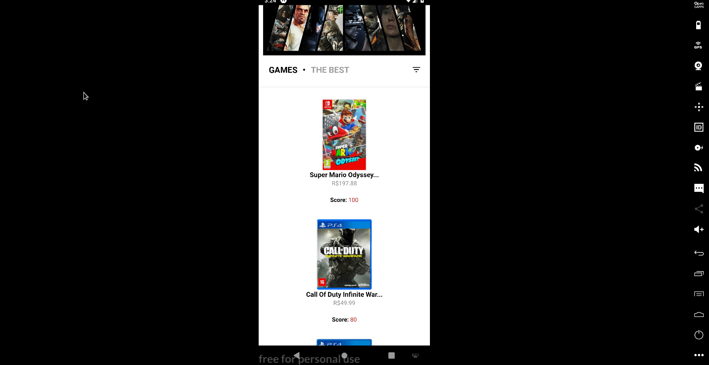

<h1 align="center">
  Ecommerce App
</h1>

<h1 align="center">
  
</h1>

## Sobre

O projeto é um desafio pra fazer listagem de jogos utilizando **React Native**, e algumas outras funcionalidades de adicionar ao carrinho e calcular o frete conforme o preço do produto, que não consegui realizar mas terei como objetivo pessoal.

---

## Tecnologias utilizadas

- [React Native](https://reactnative.dev/)
- [Expo](https://expo.io/)

---

## 📁 Como baixar o projeto

```bash

  # Clonar o repositório 😀
  $ git clone https://github.com/vitorrubim1/ecommerceGameApp.git

  # Entrar no repositório 💪
  $ cd ecommerceGamer

  # Instalar as dependências 📥
  $ yarn install

  # Iniciar o Projeto 🔥🔥
  $ yarn start

  # Ter o App Expo instalado no celular pra escanear o QRCode ou emulador
```

<p align="center"> Desenvolvido com ❤️ por Vitor Rubim </p>
